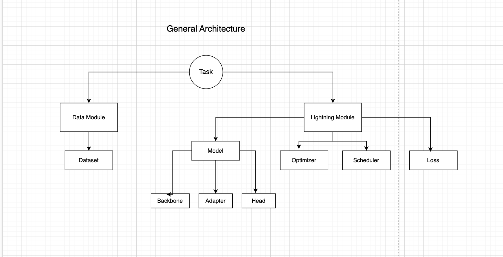

<!-- markdownlint-disable-file MD033 MD045-->
# Toxic Data Classification

## Table of Contents

- [Toxic Data Classification](#toxic-data-classification)
  - [Table of Contents](#table-of-contents)
  - [Datasets](#datasets)
  - [Modelling](#modelling)
    - [Architecture](#architecture)
      - [Task](#task)
      - [Data Module](#data-module)
      - [Lightning Module](#lightning-module)
        - [Model](#model)
        - [Optimizer](#optimizer)
        - [Scheduler](#scheduler)
        - [Loss](#loss)

## Datasets

1.) [The Gab Hate Corpus](https://osf.io/edua3/)

- Data dict

| Value | Description |
| ----- |----------- |
| NH | Not Hateful |
| CV | Call to Violence |
| HD | assault on Human Dignity |
| VD | Vulgar or Offensive |

2.) [Jigsaw toxic comment classification challenge](https://www.kaggle.com/competitions/jigsaw-toxic-comment-classification-challenge/data)

3.) [Cyberbullying Classification](https://www.kaggle.com/datasets/andrewmvd/cyberbullying-classification)

## Modelling

### Architecture

#### Task

- This can be:
  - Model training
  - Evaluation
  - Prediction

#### Data Module

#### Lightning Module

##### Model

##### Optimizer

##### Scheduler

##### Loss
